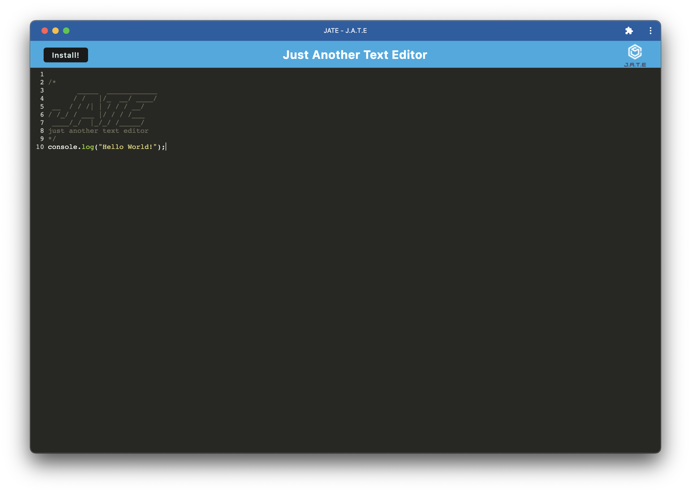

# Text Editor PWA

## Description

Single-page application designed to be a first foray into PWA development. Employs webpack, service workers, and the IndexedDB API to provide efficient loading, installation, and offline functionality. The project includes the following features in accordance with the challenge guidelines:
- Use of **Webpack** to bundle the app source code, augmented with the following features:
  - Browser compatibility ensured using `babel`.
  - Automatic HTML page generation using the `HtmlWebpackPlugin`.
  - Automatic **service worker** generation using the `InjectManifest` plugin.
  - Automatic `manifest.json` file generation using the `WebpackPwaManifest` plugin.
- Proper setup of the service worker template used by `InjectManifest`, so that assets are properly cached and offline functionality is preserved.
- Use of `IndexedDB` to autosave a persistent copy of the user's text input.
- Use of appropriate event listeners to handle application download prompts.
- Adherence to "client/server" file structure.

&nbsp;

## Usage

### Heroku Deployment
A deployed instance of the app is available [here on Heroku](https://stark-caverns-60972.herokuapp.com/).

## Credits

Starter code was provided by the UofM Coding Bootcamp (Trilogy Education Services); acceptance criteria were satisfied by edits and additions implemented by the developer.

## License

Please refer to the LICENSE in the repo.